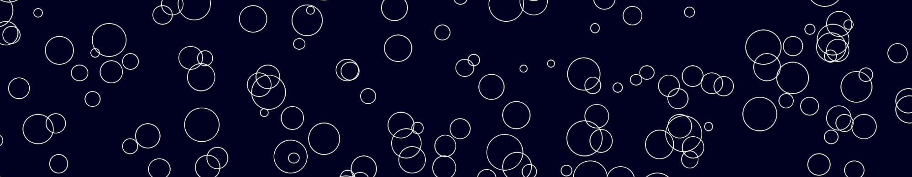

# Working With Loops

[Introductory Slides](https://docs.google.com/presentation/d/1cHWBSo9IYPSFp5LfbVmvbnL9_t2BdaTUxiaQ-ow1mYg/edit?usp=sharing)

## LEARNING OBJECTIVES
1. Practice working with loops
1. Practice working with if statements
1. Practice working with the random module

## Part 1: Animation
Please open the `cars.py` file and take a look at it. When you're done, run it using the play button (upper right-hand corner of VS Code).
* If you don't see a "play button", let one of our students know and they can help you run it in the terminal:
    ```sh
    py cars.py
    ```
* Notice how the `draw_car` function just bundles together 4 shapes (2 rectangles, 2 circles). The position and color of these shapes depends on the x, y, and color parameters.
    ```py
    def draw_car(canvas, x=0, y=0, color="#3D9970", tag=None):
        rect(canvas, x + 50, y, 100, 40, color=color, tag=tag) # top of the car
        rect(canvas, x, y + 30, 200, 45, color=color, tag=tag) # bottom of the car
        circle(canvas, x + 50, y + 80, 20, color='black', tag=tag) # left wheel
        circle(canvas, x + 150, y + 80, 20, color='black', tag=tag) # right wheel
    ```
* The code also creates a canvas (where to draw the car) and a variable to hold the car's x-position.
    ```py
    # 2. Create the canvas (window for drawing)
    canvas = create_canvas(title="Animation", background="white")
    window_width = canvas.winfo_screenwidth()
    window_height = canvas.winfo_screenheight()

    # 3. create a variable to store the x position of the car:
    car1_x = 0

    ```
* Finally, the code invokes or "calls" the `draw_car` function with some specific arguments to make a car that is teal colored.
    ```py
    # 4. Draw the car in the initial position...
    draw_car(canvas, x=car1_x, y=50, color="teal", tag="car1")
    update(canvas)
    ```

### Your Tasks
1. Try making the car animate by adding the following code below line 21:
    ```py
    time.sleep(1)  # Pauses for 1 second
    clear(canvas)  # clears out the old car drawing
    car1_x += 75   # increments the car's x-position by 75
    draw_car(canvas, x=car1_x, y=50, color="teal", tag="car1")  # draws the new car
    update(canvas) # updates the canvas so that the car appears in the new position
    ```

2. Add that code block a few more times, and see if you can get your car across the screen:
    ```py
    time.sleep(1)
    clear(canvas)
    car1_x += 75
    draw_car(canvas, x=car1_x, y=50, color="teal", tag="car1")
    update(canvas)

    time.sleep(1)
    clear(canvas)
    car1_x += 75
    draw_car(canvas, x=car1_x, y=50, color="teal", tag="car1")
    update(canvas)
    ```

3. You should notice that you're repeating the same code over and over again! Typically, if you're repeating your code over and over again, there's usually a quicker way to do things!

4. Now, try and use a **while loop**. Instead of repeating the movement code, just write it once and keep repeating it forever:
    ```py
    # while loop will move the car to the right 75 pixels every second
    while True:
        clear(canvas)
        car1_x += 75
        draw_car(canvas, x=car1_x, y=50, color="teal", tag="car1")
        update(canvas)
        time.sleep(1)
    ```

5. Can you make the car animation smoother? 

6. Can you figure out how to make a second car animate across the screen too? Hints:
    * Make sure you give your second car a unique tag.
    * Make sure you create a second variable to track the second car's x-position.
    * Make sure that you increment the second car's position within the while loop.

7. Challenges:
    *  If the car gets to the end of the screen, see if you can get it to wrap around to the beginning of the screen (hint: use an if statement). 
        * **Pseudocode**: if the car's position exceeds the width of the screen, set it's position to 0.
    * Create a `draw_truck` function.
    * Make the car move in the opposite direction.
    * Make the cars accelerate over time (start off slow and gradually move faster).


 


## Part 2: Landscapes
Please open the landscapes.py file and take a look at it:
```py
import time
import random
from utilities import rect, circle, create_canvas, clear, update

# create the canvas (window for drawing)
canvas = create_canvas(title="Starry Night", background="#000022")
window_width = canvas.winfo_screenwidth()
window_height = canvas.winfo_screenheight()

# variables that hold values for what the circle should look like
x = 400
y = 200
radius =20
outline_width = 1
outline_color = 'white'
fill_color = '#669bbc'  # Place to find nice colors: https://coolors.co/palettes/trending
circle(canvas, x, y, radius=radius, stroke_width=outline_width, outline=outline_color, color=fill_color)


########################## YOUR CODE ABOVE THIS LINE ############################## 

# makes sure the canvas keeps running:
canvas.mainloop()
```

Some things to notice:
* Like before, we create a canvas and some variables.
* We then use these variables to draw a single circle. Note that the position, size, and color of the circle can be customized.

### Your Tasks
1. Run this code (either by pressing the "play" button or by running it in the terminal: `py landscape.py`). If it worked, you should see a window with a circle appear.

2. Try changing the color, size, and position of the circle, then rerun your program.

3. Now try using the `random` module to position your circle randomly:
    ```py
    x = random.uniform(0, window_width)  # pick a random number between 0 and ~1400
    y = random.uniform(0, window_height)  # pick a random number between 0 and ~800
    radius = random.uniform(5, 20)
    outline_width = 1
    outline_color = 'white'
    fill_color = None
    circle(canvas, x, y, radius=radius, stroke_width=outline_width, outline=outline_color, color=fill_color)
    ```
    Then, run your code a few times see what happens (the circle should always appear in a different place). Why?

4. Finally, try using a **for loop** to generates 1,000 circles. The syntax for a for loop is: 
    ```py
    for i in range(n):
        # code that you want to repeat
    ```
    If you did it right, you should see something like this:
     
     
5. Challenges:
    *  See if you can make your circles different colors. Try using the random.choice() module:
        ```py
        fill_color = random.choice(['red', 'green', 'blue'])
        ```
    * See if you can animate your circles

